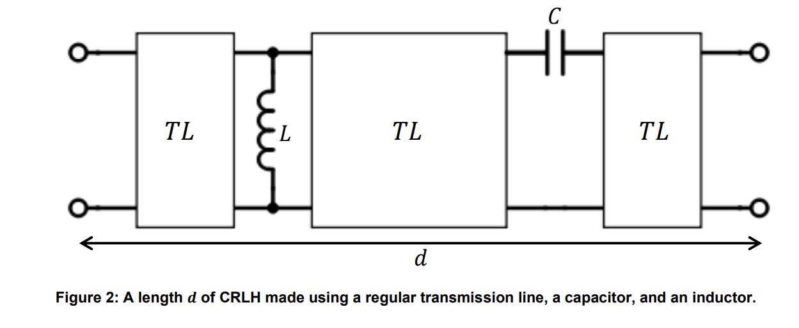

# lab3-metaMaterial-model
Simulates a MetaMaterial with ABCD matrices. 
The material consists of a number of cells. A single cell of the cirucit is described by the diagram below.
The code supports plotting the simulation data with some measured data.

